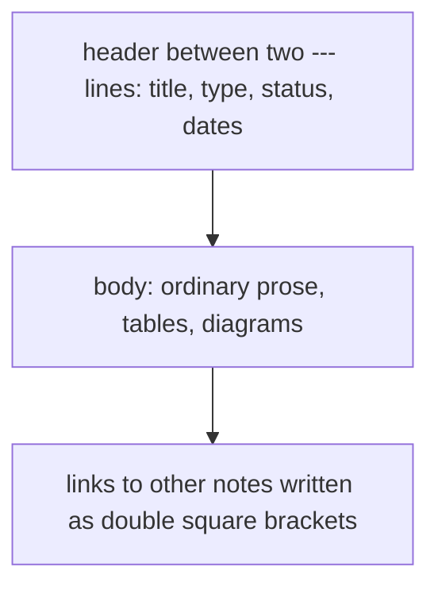

# Reading this vault

The theory behind aleArrhythmia, as plain Markdown. Any text editor works, and so does GitHub's
file view. No Obsidian needed.

Start at [index.md](index.md). Every note is two links or fewer from there.

## A note, top to bottom

The header is for the checker and, later, the website. Readers can skip it.

| Field | Meaning |
|---|---|
| title | What the note is about |
| type | One of the five types below |
| status | Where the note is in its life |
| created, updated | Dates, year-month-day |

## Note types

| Type | Folder | Holds |
|---|---|---|
| adr | decisions/ | A decision record: options, cost and gain of each, the choice, why the others lost, evidence. Numbered ADR-0001, ADR-0002, and so on. |
| theory | theory/ | Derivations and method notes |
| literature | literature/ | One note per source surveyed: a paper, an atlas, a file format |
| question | questions/ | An open question, its candidate answers, and what would settle it |
| log | logs/ | A dated record of a working session |

## Status values

| Type | Status |
|---|---|
| theory, literature, log | draft, active, archived |
| adr | proposed, accepted, superseded |
| question | open, answered |

A superseded record is never deleted. It names the record that replaced it.

## Links and citations

| Written as | Means | Checked |
|---|---|---|
| `[[canonical-reference-space]]` | The note in the file canonical-reference-space.md, in any folder | Yes: a link to a missing note fails the check |
| `ADR-0003` | Decision record number 3, cited from any file | Yes: a citation of a missing record fails the check |

On GitHub, double-bracket links show as plain text. Open the named file to follow one.

## Templates

templates/ holds one starting file per note type, with header and headings in place.

## Licence

Prose in this folder: CC-BY-4.0, reuse with attribution. Code elsewhere uses another licence; see
the root README.
