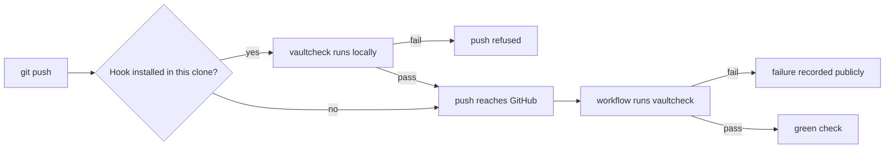

# ADR-0003: Enforcement mechanism for the traceability check

Where the check runs, and so what stops a broken decision record from entering public history.

| Point | Detail |
|---|---|
| Known limit | Git does not run hooks from a fresh clone until its owner opts in (a security property). Such a push is still checked by the workflow, but it is not refused locally. |
| Mitigation | The checker warns (HOOK-NOT-INSTALLED) whenever it runs in a clone without the hook. |
| Constitution amended | Rejecting pull requests left a Governance rule binding "every pull request description". Constitution v1.2.0 moved that duty to the commit message. |
| Verified | Both paths tested: [[log-2026-09-21-enforcement-verification]] |

Reformatted on 2026-09-21 per [[ADR-0005-writing-style]]. Options, trade-offs, choice and reasons
are unchanged. The original wording is in commit 485b906.

## Options considered

| Option | What it means |
|---|---|
| A. Pre-push hook plus workflow on every push | A tracked hook refuses a broken push before it leaves the machine. A workflow runs the same check on every push that arrives. |
| B. Pull requests with a required check | All work goes through pull requests; the check must pass to merge. |
| C. The pre-commit framework | The check is registered with the pre-commit tool, which manages the hook. |
| D. Workflow only | No local hook. The workflow alone checks each push. |

## Trade-offs

| Option | Cost | Gain |
|---|---|---|
| A | One install step per clone. An uninstalled clone is caught publicly, not locally. | Local failure in under a second. Public pass/fail record. A visible, deliberate override. |
| B | A pull request for every change, reviewed by the same single author | Strongest conventional signal. Merge genuinely blocked. |
| C | A dependency and a config file to replace a few lines of shell. Still needs a per-clone install. | Familiar tool, easy to add other checks |
| D | Broken records become public before anyone learns of them | No setup at all |

## Chosen

A. Neither point is enough alone. The hook gives fast private failure. The workflow checks every
push whether or not the hook was installed, and shows the result publicly. It fits how the project
is worked on: one author pushing directly.

## Rejected

| Option | Why it lost |
|---|---|
| B | A review ritual with nobody to review, on every change. The author declined it. If regular contributors join, a new record supersedes this one. |
| C | Principle VII: a dependency to replace a few lines of shell, and the fresh-clone gap stays open |
| D | Broken records go public before they are caught, which the check exists to prevent |

## References

- Constitution, Principle VIII and Governance as amended in v1.2.0: `.specify/memory/constitution.md`
- Spec 001, FR-023 and FR-023a: `specs/001-theory-vault-traceability/spec.md`
- Research note R-008: `specs/001-theory-vault-traceability/research.md`
- Clarification session, 2026-09-20: [[log-2026-09-20-clarification]]
- Git hooks and core.hooksPath: https://git-scm.com/docs/githooks
