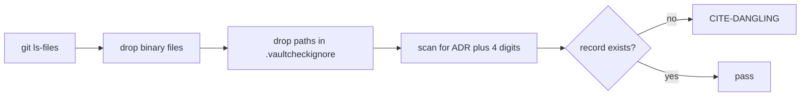

# ADR-0004: Citation scan scope

Which files the checker searches for citations of decision records, and what text counts as one.

| Detail | Rule |
|---|---|
| Citation form | Exactly "ADR-" plus four digits, on a word boundary. Looser patterns match prose such as "ADR-1" and version strings. |
| Ignore format | One glob per line, each with a trailing "# reason". No reason: error. Glob matching nothing: warning. |

Reformatted on 2026-09-21 per [[ADR-0005-writing-style]]. Options, trade-offs, choice and reasons
are unchanged. The original wording is in commit 7eade79.

## Options considered

| Option | What it means |
|---|---|
| A. All tracked text files, minus a reasoned ignore list | Git's file list, binaries dropped, exclusions in a tracked file with a reason per entry |
| B. Vault plus specs and plans | Documentation scanned, source code not |
| C. Vault only | Notes under docs/vault only |
| D. Walk the filesystem | Every text file on disk, tracked or not, with the checker's own ignore rules |
| E. As A, with full gitignore syntax | Same scope, with negation and anchoring in the ignore file |

## Trade-offs

| Option | Cost | Gain |
|---|---|---|
| A | A small ignore file to maintain. Care over false positives, since specs quote example ids on purpose. | No place for a citation to hide. Every exclusion is visible and reviewed. |
| B | Code, where drift does most damage, goes unchecked | No false positives from code |
| C | FR-012 unenforced outside the vault | Simplest scan |
| D | Picks up scratch files, backups and build output. Reimplements what Git already knows. | Independent of Git, which the project does not need |
| E | An extra dependency or a reimplementation of gitignore rules | Richer patterns, for a file of a handful of lines |

## Chosen

A. Work cites the decision it embodies, and much of the work is code. The four-digit form keeps
false positives rare, the ignore list handles the deliberate cases, and a required reason per
entry keeps the list from filling with inconvenient files.

## Rejected

| Option | Why it lost |
|---|---|
| B | Leaves code unchecked, the place drift does most damage |
| C | Reduces FR-012 to a rule nothing enforces outside the vault |
| D | Scans files that are not part of the project. Principle VII favours reusing Git's own file list. |
| E | Machinery out of proportion to a file of a few entries |

## References

- Constitution, Principle VIII: `.specify/memory/constitution.md`
- Spec 001, FR-017a: `specs/001-theory-vault-traceability/spec.md`
- Research notes R-009 and R-010: `specs/001-theory-vault-traceability/research.md`
- The ignore list: `.vaultcheckignore`
- Clarification session, 2026-09-20: [[log-2026-09-20-clarification]]
