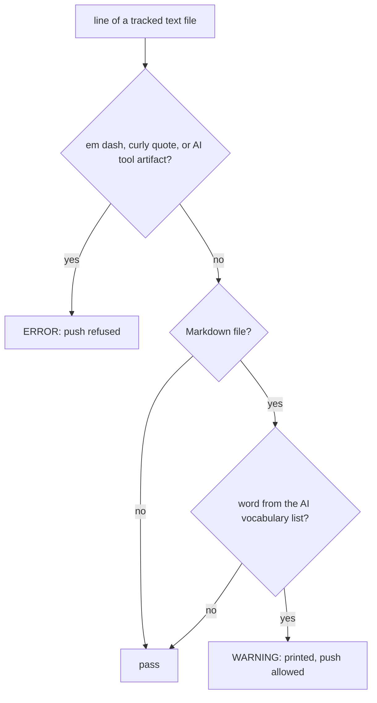

# ADR-0005: Writing style and its enforcement

Raised by the author on 2026-09-21 in a reader trial of ADR-0001: content sound, form too
prose-heavy, with marks of machine-written text.

## Options considered

| Option | What it means |
|---|---|
| A. Block mechanical tells, warn on vocabulary | Em dash, curly quotes and AI tool artifacts fail the check. A word list from the Wikipedia page is reported as a warning. |
| B. Block everything | Mechanical tells and the word list all fail the check. |
| C. Block the em dash only | One character checked, the rest left to review. |
| D. No check | Rules written down and followed by habit. |

## Trade-offs

| Option | Cost | Gain |
|---|---|---|
| A | A word list to maintain. Warnings can be ignored. | No false failures on legitimate words. Mechanical tells cannot reach the repository. |
| B | False failures: words such as "key" or "landscape" have real uses in cardiac anatomy. | Strongest guarantee |
| C | Curly quotes and tool artifacts pass unnoticed | Simplest rule, no false failures |
| D | Rules erode under time pressure, when they matter most | No tooling |

## Chosen

A. The mechanical tells have no legitimate use here, so blocking them costs nothing. Vocabulary
depends on context, so a warning is the right strength: visible on every run, never a false refusal.

| Rule applied by review | Detail |
|---|---|
| Tables | For content with real rows and columns |
| Flowcharts | For sequences and decisions |
| Prose | Short sentences, only where a table or diagram cannot carry it |
| Avoid | Bold labels in front of list items; horizontal rules between sections |
| Document references | Path plus section name. Line numbers only for code, since amended documents shift and a stale line number can still be in range. |

| Consequence | Detail |
|---|---|
| Existing records reformatted | ADR-0001 to ADR-0004 moved to tables. Options, trade-offs, choice and reasons are unchanged, and each record names the commit holding its original wording. FR-011 forbids rewriting a decision; a layout change that keeps every decision element identical does not rewrite it. |

## Rejected

| Option | Why it lost |
|---|---|
| B | Blocks legitimate anatomical and statistical words, which trains people to reword around the checker |
| C | Leaves two tells with no legitimate use unchecked, for no gain |
| D | Contradicts Principle VIII: a rule the project cares about gets a mechanical check |

## References

- Wikipedia, Signs of AI writing: https://en.wikipedia.org/wiki/Wikipedia:Signs_of_AI_writing
- Constitution, Principle VIII: `.specify/memory/constitution.md`
- Reader trial where this was raised: [[log-2026-09-21-reader-trial-adr-0001]]
- The checker rules: `tools/vaultcheck/style.py`
