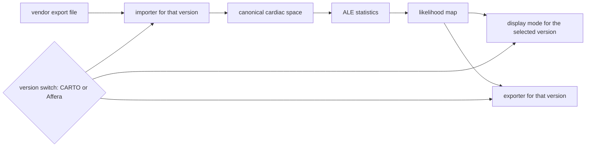

# ADR-0006: Two vendor versions of the map viewer

The author asked for the map to exist in a CARTO version and an Affera version, with a switch
between them. This records what a version is, which systems get one, and the limits.

## Options considered

| Option | What it means |
|---|---|
| A. Two first-class versions, others surveyed | CARTO 3 and Affera each get an importer, an exporter and a display mode. EnSite X EP, Rhythmia HDx and KODEX-EPD stay in the survey with no build commitment. |
| B. Five first-class versions | Every surveyed system gets the same three parts. |
| C. CARTO and Affera only | The other three leave the project entirely, including the survey. |
| D. One neutral viewer | No vendor modes. A single display, a single exchange format. |

## Trade-offs

| Option | Cost | Gain |
|---|---|---|
| A | Two formats to read and track across vendor releases | Familiar view for the two named systems, and the other three stay documented for later |
| B | Five formats to reverse engineer and keep working. Affera's format may not be public, so the phase could stall on one vendor. | Widest reach |
| C | Loses the Abbott, Boston Scientific and Philips user base, and discards survey work already planned | Sharpest focus |
| D | An electrophysiologist reads the map against unfamiliar conventions, which is where misreading starts | Least work, no vendor coupling |

## Chosen

A. Two systems is enough to prove the idea transfers between vendors, which one system cannot show,
and small enough to finish. The other three keep their survey notes, so choosing them later needs no
rediscovery.

A version has three parts, and the switch changes all three at once:

| Part | Does |
|---|---|
| Importer | Reads that system's exported geometry and points into the project's canonical space |
| Exporter | Writes the likelihood map in a form that system or its users can load |
| Display mode | Colour scale, standard views and orientation labels following that system's conventions |

Limits that hold whatever the version:

| Limit | Reason |
|---|---|
| Offline files only, never a live connection to a mapping system | Principle V: add-on, not replacement |
| Display conventions may be matched; branding, logos and interface copies may not | Trademark, and nobody should read the viewer as vendor endorsed |
| Every view keeps the research-use statement | Principle VI |
| The switch changes presentation and input or output, never the statistics | The same coordinates and the same map under both versions, otherwise the two views would disagree |

## Rejected

| Option | Why it lost |
|---|---|
| B | Five formats at once risks stalling the phase on the one vendor whose format may not be public, for reach the project cannot yet use |
| C | Throws away survey work and three user bases for focus that option A already gives |
| D | A map read against unfamiliar conventions invites misreading, and the project exists to guide where a catheter goes |

## Unknowns

| Unknown | What is known now |
|---|---|
| Whether Affera exports geometry and points in a documented form | Nothing established. The system is recent. To be settled by the survey, and recorded as an unknown if it cannot be |
| Whether CARTO 3 export parsing is legally and technically open | Precedent exists: OpenEP, Apache-2.0, carries a CARTO 3 importer and its paper names Carto3 among three supported systems |
| Which colour scales and view presets each system uses by default | To be recorded from published material during the survey |

## References

- Constitution, Principle V as amended in v1.3.0: `.specify/memory/constitution.md`
- Spec 001, FR-026: `specs/001-theory-vault-traceability/spec.md`
- Williams SE and others, OpenEP, Frontiers in Physiology 2021: 10.3389/fphys.2021.646023
- OpenEP source, Apache-2.0, with a CARTO importer: https://github.com/openep/openep-core
- OpenEP project site: https://openep.io/
- Session where this was asked: [[log-2026-09-23-viewer-versions]]
