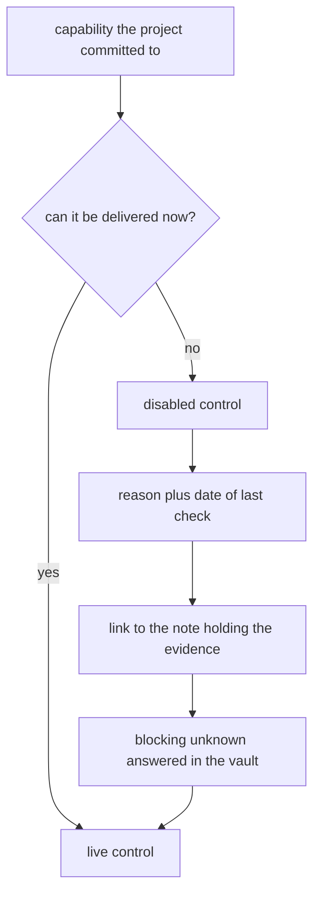

# ADR-0007: How an unavailable capability is presented

The survey ([[survey-unknowns-2026-09-24]]) found two things the project intends to do but cannot
yet: read Affera exports, and ship a reference anatomy. Both will be visible to a user. This
records how the project shows a capability it has committed to but cannot deliver.

## Options considered

| Option | What the user sees |
|---|---|
| A. Disabled control with a stated reason | The control is present but not clickable. A tooltip names the gap and its date. |
| B. Partial function | The parts that work are live, only the blocked part is disabled. |
| C. Placeholder panel | Selecting the feature replaces the view with an explanation. |
| D. Hide until it works | The feature does not appear at all. |

## Trade-offs

| Option | Cost | Gain |
|---|---|---|
| A | The user cannot see anything of the feature, not even its display conventions | Nothing can be misread as working. The commitment stays visible and dated |
| B | A half-working mode invites the reader to trust output the project cannot stand behind | Most function delivered soonest |
| C | Builds a second view that is discarded once the gap closes | Room to explain the gap fully |
| D | The reader cannot tell whether the gap was missed or investigated | Nothing unfinished ships |

## Chosen

A. A committed but unavailable capability appears as a disabled control carrying the reason and the
date the gap was last checked.

| Rule | Reason |
|---|---|
| The control is visible, never hidden | Option D loses the record that the gap was investigated. The survey work has to stay legible to a reader who never opens the vault |
| The control is not clickable | Nothing partial is offered, so nothing can be mistaken for a working result |
| The reason and its date are stated on the control | An undated gap cannot be told from a stale one |
| The reason links to the note holding the evidence | Principle VIII. A user who wants to know what was searched can reach it |
| A gap closes only by evidence, not by time passing | The disabled state persists until the blocking unknown is answered in the vault |

Applies now to:

| Capability | Blocked by | Note |
|---|---|---|
| Affera import | No public export format found | [[affera-export]] |
| Bundled reference anatomy | No licence stated by the publisher | [[cardiac-atlas-project-biventricular-modes]] |

## Rejected

| Option | Why it lost |
|---|---|
| B | A viewer that renders in Affera conventions while unable to read Affera files invites the reader to assume the pipeline is whole. The project guides where a catheter goes, so ambiguity about what is real costs more than the lost function |
| C | A whole view built to explain an absence, then thrown away. Option A carries the same message on the control itself |
| D | Silence reads as an oversight. The survey found the gap deliberately, and that finding is worth as much as a working feature |

## References

- Constitution, Principle VIII: `.specify/memory/constitution.md`
- Decision this extends: [[ADR-0006-viewer-versions]]
- Evidence for the two gaps: [[survey-unknowns-2026-09-24]]
- Session where this was asked: [[log-2026-09-24-survey-and-gaps]]
