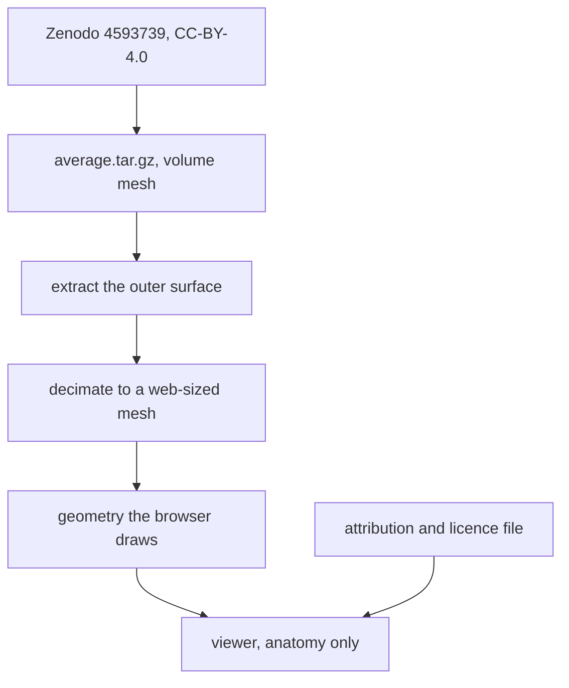

# ADR-0008: Reference anatomy for the viewer

The viewer needs a heart to draw. Principle I requires anything the project ships to carry an open
licence, and the candidate surveyed in Phase 0 states none. A second survey found several that do.

## Options considered

| Option | What it means |
|---|---|
| A. Rodero average four-chamber mesh | Bundle the mean heart from Zenodo 4593739, CC-BY-4.0, with attribution. |
| B. Generated idealised ventricle | Produce a prolate ellipsoid shell in code. No external data at all. |
| C. Both, switchable | Ship the idealised shape and the real mesh, and let the reader choose. |
| D. BodyParts3D surfaces | Browser-native geometry already in OBJ, under a share-alike licence. |
| E. Cardiac Atlas Project modes | The Phase 0 candidate, which states no licence. |

## Trade-offs

| Option | Cost | Gain |
|---|---|---|
| A | Research-grade volume mesh, tens of megabytes, needs surface extraction and decimation before a browser can draw it. Segment labelling needs anatomical landmarks | A real human heart, all four chambers, atria included, redistributable with attribution |
| B | Not a real heart. Nobody would mistake the shape for anatomy, which is honest but limited | Ships immediately. 37 KB, 3136 vertices, and all 17 segments fall out of the geometry exactly |
| C | Two pipelines and two sets of expectations at once, before either is proven | The reader sees both, and neither pretends to be the other |
| D | Share-alike obliges the project to license the mesh directory, and any modified mesh, under the same terms | Already browser-native, so no preprocessing |
| E | Nothing grants redistribution, so Principle I forbids shipping it | None that the others do not give |

## Chosen

A. The Rodero average four-chamber mesh.

| Reason | Detail |
|---|---|
| The licence is explicit | The Zenodo record states Creative Commons Attribution 4.0 International. Read directly on 2026-09-25, not inferred |
| It is a real heart | The project exists to describe where arrhythmias arise. An idealised shell cannot carry that, and would have to be replaced later anyway |
| Four chambers arrive together | Atrial and ventricular geometry in one mesh, so the project does not need two anatomies before it can draw anything |
| Attribution only | No share-alike obligation spreads into the repository, unlike option D |

Conditions that hold whatever the anatomy:

| Condition | Reason |
|---|---|
| The mesh is a population mean and MUST be labelled as such, never as a patient | It is a statistical average. Presenting it as the anatomy of a person would be false |
| Attribution ships with the mesh, in the repository and in the viewer | The licence requires credit, and Principle IV requires provenance |
| The mesh directory records its licence separately from the code licence | The data is CC-BY-4.0, the software is Apache-2.0, and the boundary has to be legible |
| The viewer states that it shows anatomy only, with no statistical result | Principle VI, and there is no statistical core yet |

## Rejected

| Option | Why it lost |
|---|---|
| B | An idealised shell is honest but it is not the thing the project is about. It would be replaced within one phase, so the pipeline cost is paid either way. Kept in reserve if decimation proves harder than expected |
| C | Two anatomies before one works. The switch is worth building later, and ADR-0006 already needs a switch mechanism that this could reuse |
| D | Share-alike would attach an obligation to every mesh the project derives, for a convenience that option A pays for once in preprocessing |
| E | No stated licence, so Principle I forbids bundling it. Superseded in practice by option A |

## References

- The chosen dataset: [[rodero-four-chamber-meshes]]
- The atrial counterpart, for later: [[nagel-biatrial-shape-model]]
- What else was surveyed: [[other-open-cardiac-meshes]]
- The candidate this replaces: [[cardiac-atlas-project-biventricular-modes]]
- Constitution, Principles I, IV and VI: `.specify/memory/constitution.md`
- Zenodo record, licence read 2026-09-25: https://zenodo.org/records/4593739
- Session where this was decided: [[log-2026-09-25-anatomy-licensing]]
