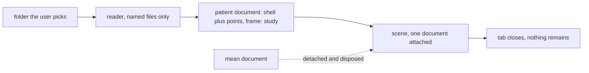

# ADR-0009: Study data stays in the browser

Feature 003 adds a second viewer mode that draws one study's own mapping export: its shell and its
points, in its own frame. A mapping export is clinical data. This records where that data is
allowed to go, and how the two modes are kept apart. Asked in the second clarification session of
`specs/003-anatomy-viewer/spec.md` and in [[log-2026-09-25-eam-datasets]].

## Options considered

| Option | Where the study file goes |
|---|---|
| A. Browser only | The user picks a folder. The page reads the named files with the File API, draws them, and keeps nothing. Closing the tab ends it |
| B. Server side | The file is uploaded to the site, parsed there, and the result returned |
| C. Browser plus opt-in local save | As A, with a control that stores the parsed study in the browser for next time |
| D. No import at all | The viewer shows only the population mean, and coordinates typed by hand |

## Trade-offs

| Option | Cost | Gain |
|---|---|---|
| A | Every parser runs in the browser, so each format needs a JavaScript reader. Large exports load slowly on weak machines | Nothing leaves the machine. The site never holds clinical data. The privacy claim is testable: zero requests, empty storage |
| B | A personal static site becomes a processor of clinical data, with everything that implies. The site would need a backend it does not have | Parsers in one language, on one machine |
| C | Clinical data at rest in a browser profile that may be shared, on a machine the project does not control | Convenience on the second visit |
| D | The project's stated purpose, an add-on to mapping systems, has nothing to add on to | Nothing to protect |

## Chosen

A. Study files are read entirely in the browser, never transmitted, never persisted. The two modes,
population mean and patient, are separate documents; exactly one is attached to the scene at a
time, and each owns its own point list, so a point from one cannot be drawn on the other.

| Rule | Reason |
|---|---|
| The page makes no request after load except for its own assets | FR-013j. A test records every request and fails on any other |
| Nothing is written to local storage, session storage or IndexedDB | FR-013k. A test inspects all three before and after a load |
| A reader opens only the files it names, never the rest of the folder | Least exposure. Electrograms, ECGs and settings are never read into memory. Since [[ADR-0010-study-values-on-the-study-shell]], the value file is one more named file, opened only when the reader turns the value control on |
| Mode exclusivity is structural, not a flag | Research R-006. The inactive document has zero children, and there is no shared point list to get wrong |
| No registration between the study frame and the mean | FR-013e and Principle II. Every coordinate is labelled with the frame it belongs to |
| Study files are never committed to the repository | FR-013m. A test fails if one is tracked |
| A study fixture is used only after de-identification is verified by inspection | FR-013n. Being told a file is anonymised is a claim, not a check |

## Rejected

| Option | Why it lost |
|---|---|
| B | Turns a static research page into a data controller. Principle V says add-on, not replacement; an add-on that ingests clinical data on a server is neither small nor safe |
| C | The convenience is real but the exposure is the wrong kind. A viewer that remembers a patient on a shared computer is a different product |
| D | The clarification session asked for exactly this mode, and the first real export showed that geometry and points travel together, so the mode is coherent |

## References

- Constitution, Principles II, V and VI: `.specify/memory/constitution.md`
- Specification, clarification session 2 and FR-013a to FR-013r: `specs/003-anatomy-viewer/spec.md`
- Research R-006 and R-007: `specs/003-anatomy-viewer/research.md`
- The session where the datasets were found: [[log-2026-09-25-eam-datasets]]
- The two fixtures: [[openep-testingdata-carto-export]], [[argo-ventricular-tachycardia-dataset]]
- How the disabled import controls are presented meanwhile: [[ADR-0007-unavailable-capability]]
