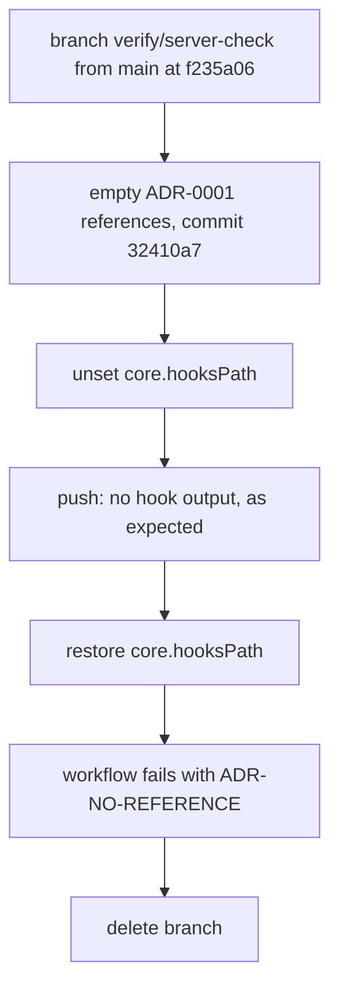

# Verification of both enforcement points, 2026-09-21

Evidence that each half of [[ADR-0003-enforcement-mechanism]] refuses a broken decision record.
Task T037 of spec 001.

## Local half: pre-push hook

Hook installed with `git config core.hooksPath .githooks`, then run three times:

| Run | ADR-0001 state | Hook exit | Output |
|---|---|---|---|
| 1 | Unchanged | 0 | clean |
| 2 | References section emptied on disk | 1 | ADR-0001-repository-layout.md line 64, ADR-NO-REFERENCE, push refused |
| 3 | Restored | 0 | clean |

Every real push afterwards also ran the hook; its summary line prints before Git sends anything.

## Repository half: workflow

Tests the case the hook cannot cover, a clone with no hook installed. Done on a throwaway branch, so
main was never touched.



Workflow output, as recorded at the time:

```text
docs/vault/decisions/ADR-0001-repository-layout.md:64: ADR-NO-REFERENCE: '## References' has no content
vaultcheck: 7 notes, 4 decision records, 13 links, 36 citations verified: 1 violation
Process completed with exit code 1.
```

| Run | Result | Link |
|---|---|---|
| Throwaway branch, 32410a7 | failure | https://github.com/vanioljantunes/aleArrhythmia/actions/runs/35625031339 |
| main, f235a06 | success | https://github.com/vanioljantunes/aleArrhythmia/actions/runs/35624850054 |

The failed run stays in the Actions history on purpose, as the public record that the backstop
works.

History was rewritten on 2026-09-21 to remove references to an unrelated local folder. Commit
hashes in this log now point at the rewritten history. Both Actions runs executed before the
rewrite, on hash 99d6bb3 (now f235a06) and on the throwaway commit 32410a7, which was never on main.

## Not done

The documented override flag was not used. The author's standing rules forbid bypassing hooks, and
a local guard blocks it. The uninstalled-clone path exercises the same server-side check.

Reformatted on 2026-09-21 per [[ADR-0005-writing-style]]; content unchanged. The quoted summary
line shows the checker's current punctuation; the run log itself is linked above.
