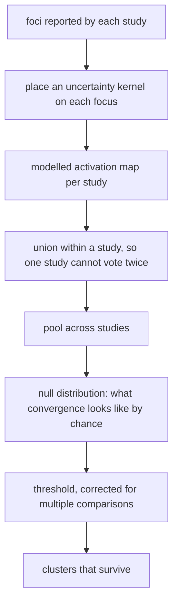

# Activation Likelihood Estimation and what changes for the heart

What ALE does in brain imaging, and which parts do not transfer to the heart unchanged.

## Setting

| Assumption in the fMRI setting | Why it holds there | Status for the heart |
|---|---|---|
| All studies report in one agreed space | The field agreed on stereotaxic spaces | Open, see [[canonical-reference-space]] |
| A focus is a point with spatial uncertainty | Uncertainty comes from subject count and template registration | Plausible, with different error sources: registration, catheter position, respiration and cardiac motion |
| The domain is a fixed volume | The brain is imaged as a volume | The heart is better treated as a surface or a thin wall, and it moves |

## Derivation

| Step | Point of it |
|---|---|
| Kernel per focus | Turns a reported point into a spatial probability, so near misses between studies still agree |
| Union within a study | A study reporting many foci in one area does not dominate |
| Random effects pooling | Inference is about studies, not about subjects pooled together |
| Null by permutation or analytic derivation | Answers how much spatial convergence chance alone produces |
| Correction | Cluster level family wise error or false discovery rate, stated with every map |

## What changes for the heart

| fMRI step | Cardiac replacement | Reason |
|---|---|---|
| Stereotaxic volume | A cardiac reference space, still undecided | No agreed cardiac equivalent exists |
| Kernel width from subject count | Kernel width from registration error, mapping system spatial error and anatomical variability | The uncertainty sources differ, and are larger |
| Voxels in a volume | Vertices or coordinates on a surface or thin wall | Ventricular wall and atrial surface are not well modelled as a solid volume |
| Study reports a coordinate | Study may report only a segment name | Segment-only reports need a documented rule, see [[hybrid-coordinate-and-segment]] |

## Open points

| Question | Where |
|---|---|
| Which canonical space | [[canonical-reference-space]] |
| How to turn a segment-only report into a distribution | [[hybrid-coordinate-and-segment]] |
| What kernel width the cardiac error sources imply | Not yet written |

## References

- Turkeltaub and others, Meta-analysis of the functional neuroanatomy of single-word reading, NeuroImage 2002: 10.1006/nimg.2002.1131
- Eickhoff and others, Coordinate-based activation likelihood estimation meta-analysis, Human Brain Mapping 2009: 10.1002/hbm.20718
- Eickhoff and others, Activation likelihood estimation meta-analysis revisited, NeuroImage 2012: 10.1016/j.neuroimage.2011.09.017
- Constitution, Principle III: `.specify/memory/constitution.md`
