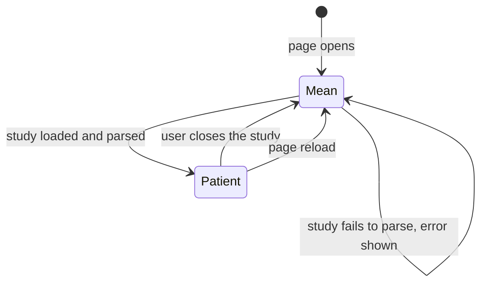

# Data Model: The first 3D viewer

Six entities. None is persisted anywhere except the derived geometry and its manifest, which are
committed files.

## Entities

### DerivedGeometry

The one committed heart.

| Field | Type | Rule |
|---|---|---|
| file | `heart.glb` | glTF 2.0 binary, one mesh |
| primitives | 24 | One per source structure, named `structure-<id>` |
| positions | float32, mm | In the source mesh's own frame, untransformed |
| normals | float32 | Smooth, area-weighted |
| indices | uint16 per primitive | Every primitive under 65,535 vertices |
| segment | uint8 per vertex, 0 to 17 | 0 means no segment; 1 to 17 the AHA segment |
| triangles | at most 60,000 total | Each primitive at least 150 |

### GeometryManifest

What makes DerivedGeometry reproducible and traceable. Contract in `contracts/geometry-manifest.md`.

### Structure

One named anatomical part, as the source labels it.

| Field | Type | Rule |
|---|---|---|
| id | 1 to 24 | The source's `ID` cell scalar |
| name | string | From the source's labelling if found; otherwise `structure <id>` and never a guess |
| visible | boolean | Reader-controlled; default true |

### Segment

One AHA region, derived, not asserted.

| Field | Rule |
|---|---|
| id | 1 to 17 |
| name | The AHA 2002 name |
| origin | The anterior RV insertion, found from the data, checked by test |
| shipped | Only if the insertion check passes; else the control is disabled and the reason recorded |

### Study

One export read in the browser. Contract in `contracts/study-shape.md`. Every reader produces this
same shape regardless of source format.

| Field | Type | Rule |
|---|---|---|
| source | `carto` or `argo` | Names the reader, never a claim about a vendor |
| label | string | The map or folder name, shown to the user |
| geometry | positions, indices | That study's own shell |
| points | list of Point | That study's own recorded positions |
| frame | always `study` | Stated on screen. Never `canonical` |

### Point

A position and nothing else.

| Field | Type | Rule |
|---|---|---|
| position | three numbers, mm | In the owning document's frame |
| label | string | Its name in the source, or the order it was typed |
| origin | `manual`, `mapped`, `ablation` | Distinguishes what the reader typed from what the file held |
| outside | boolean | True when outside the geometry's bounding box; shown, never clamped |

A Point carries no value, colour scale, weight or probability. FR-013i.

## The mode state machine

| Invariant | Enforced by |
|---|---|
| Exactly one document is attached to the scene | The switch detaches one before attaching the other, and the test counts children |
| A Point belongs to exactly one document | Points are a field of the document, and no other list exists |
| Patient data lives only in memory | No storage call exists in the code; the test inspects storage before and after |
| Reload returns to Mean with no points | Nothing is persisted, so there is nothing to restore |

## Relationships

- A **DerivedGeometry** has 24 **Structures** and carries a **Segment** id on every vertex.
- A **GeometryManifest** describes exactly one **DerivedGeometry**.
- A **Study** owns its own geometry and many **Points**; it never references a **DerivedGeometry**.
- The mean document owns the **DerivedGeometry** and any manual **Points**; it never references a
  **Study**.
